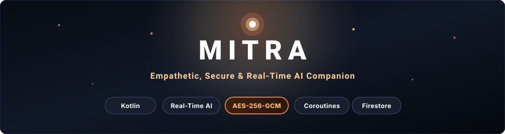

<p align="center">
  
</p>

# Mitra (Beta)

> **Note:** This project is currently in **Beta** and under active development. Features, APIs, and UI are actively being updated.

Mitra is an Android companion app built using native Kotlin and modern Android architecture. It streams AI responses in real-time, encrypts saved chats on-device before syncing to Firestore, and includes built-in crisis detection for mental health support.

---

## Features

- **Real-time AI Streaming**: Responses stream token-by-token using OkHttp and Kotlin Coroutine Flows instead of waiting for full responses.
- **Client-Side Encryption**: Saved messages are encrypted locally using AES-256-GCM before syncing to Firestore. Session keys are held in memory only.
- **Crisis Detection**: Matches crisis keywords and patterns across English, Hindi, and Hinglish, automatically displaying a support card with the Tele-MANAS hotline (`14416`).
- **Incognito Mode**: In-memory chat sessions that are never written to Firestore or local storage.
- **Voice Support**: Voice input using Android's native `SpeechRecognizer` and spoken responses via `TextToSpeech`.
- **Custom UI & Animations**: Ambient ember particle background rendered with a custom hardware-accelerated `ParticleView` canvas, breathing glow effects, and touch 3D card tilt.
- **Offline Access**: Offline persistence via Firestore so chat history remains available without internet.

---

## Tech Stack

- **Language**: Kotlin (JDK 17)
- **SDK**: Min API 26 (Android 8.0) | Target API 34 (Android 14)
- **Architecture**: MVVM + Repository Pattern
- **Dependency Injection**: Hilt (Dagger)
- **Async**: Coroutines & Flows (`StateFlow`, `SharedFlow`, `callbackFlow`)
- **Networking**: Retrofit 2, OkHttp 3, Gson
- **Firebase**: Firebase Auth, Cloud Firestore, Analytics
- **UI**: ViewBinding, Material Components 3, ConstraintLayout, Custom Views

---

## Setup & Running

1. **Clone the repository**
   ```bash
   git clone https://github.com/yadavnikhil03/Mitra.ai.git
   cd Mitra.ai
   ```

2. **Add Firebase config**
   - Create a project in [Firebase Console](https://console.firebase.google.com/) with Email/Password Auth and Cloud Firestore enabled.
   - Download `google-services.json` and place it in the `app/` folder (`app/google-services.json`).

3. **Build & Run**
   - Open in Android Studio (Koala / Jellyfish or newer).
   - Sync Gradle and run on an emulator or device running Android 8.0+.

---

## Beta Releases

- **Downloads**: Download pre-built APKs directly from the repository's [Releases](../../releases) tab.

---

## Credits & Acknowledgements

- **Web App**: [Mitra](https://github.com/Akashkmr07/Mitra) by [@Akashkmr07](https://github.com/Akashkmr07)
- **Original Project**: [Mitra](https://github.com/sachin1437/Mitra) by [@sachin1437](https://github.com/sachin1437)

---

## License

Licensed under the [GNU General Public License v3.0](LICENSE).
